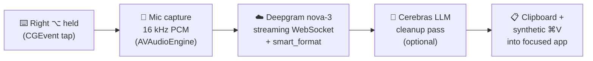

# 🎙️ SwiftFlow

**Push-to-talk AI dictation for macOS.** Hold a key, speak, release — and clean, punctuated text lands at your cursor in *any* app. Like [Wispr Flow](https://wisprflow.ai), but open source, ~700 lines of native Swift, and powered by APIs you control.


```
Hold Right ⌥  →  speak  →  release  →  your words appear, cleaned up, wherever your cursor is
```

## How it works



1. **Hotkey** — a CGEvent tap watches for Right Option (⌥) press/release system-wide.
2. **Audio** — while held, `AVAudioEngine` captures the mic and converts to 16 kHz mono Int16 PCM.
3. **Transcription** — chunks stream to [Deepgram](https://deepgram.com)'s nova-3 model over a WebSocket; `smart_format` adds punctuation, casing, and number formatting. Audio spoken before the socket finishes connecting is buffered, so the first words are never lost.
4. **Cleanup (optional)** — the transcript gets one fast LLM pass via [Cerebras](https://cerebras.ai) (~2000 tok/s): filler words removed, self-corrections resolved (*"send it Tuesday— no, Wednesday"* → *"send it Wednesday"*). If the LLM errors or exceeds 6 s, the raw transcript is used — dictation never hangs.
5. **Injection** — the text is placed on the clipboard, a synthetic ⌘V pastes it into whatever app has focus, and your original clipboard is restored.

Sound cues tell you what's happening without looking: **pop** = recording, **tink** = text pasted, **low buzz** = nothing was heard. The menu bar icon mirrors it: 🎙 idle → 🔴 red mic recording → 🟠 waveform processing.

## Requirements

- macOS 13+ (Apple Silicon or Intel)
- Xcode Command Line Tools (`xcode-select --install`)
- A [Deepgram API key](https://console.deepgram.com) — free tier includes $200 credit (streaming ≈ $0.006/min)
- A [Cerebras API key](https://cloud.cerebras.ai) — optional, only for the cleanup pass; free tier available

## Install

```sh
git clone https://github.com/SandyCodeSenpai/swiftflow.git
cd swiftflow

# 1. Add your API keys
mkdir -p ~/.swiftflow
cp config.example.json ~/.swiftflow/config.json
$EDITOR ~/.swiftflow/config.json   # paste your keys

# 2. Build the menu bar app
./build_app.sh

# 3. Run
open SwiftFlow.app
```

### Grant permissions (one time)

| Permission | Why | Where |
|---|---|---|
| **Microphone** | capture your speech | macOS prompts automatically on first dictation |
| **Accessibility** | hotkey listener + ⌘V injection | System Settings → Privacy & Security → Accessibility → enable **SwiftFlow** |

The app opens the Accessibility pane for you on first launch and re-checks every 3 seconds — the moment you toggle it on, the hotkey goes live. No relaunch needed.

> **Rebuilding?** `build_app.sh` resets the Accessibility grant automatically (ad-hoc signatures change every build, which silently invalidates the old grant). Just re-toggle SwiftFlow in System Settings after each rebuild.

## Usage

1. Click into any text field, in any app.
2. **Hold Right Option (⌥)** — *pop*, mic turns red.
3. Speak naturally. Release the key.
4. *Tink* — your text is at the cursor.

The menu bar menu has live toggles for the **AI Cleanup** pass and **Sound Effects**.

### Configuration

`~/.swiftflow/config.json`:

| Key | Default | Description |
|---|---|---|
| `deepgram_api_key` | — | required |
| `cerebras_api_key` | — | optional; empty disables cleanup |
| `cerebras_model` | `llama-3.3-70b` | any Cerebras chat model |
| `cleanup_enabled` | `true` | LLM pass on/off at launch |
| `sounds_enabled` | `true` | audio cues on/off at launch |

## Architecture

Small, deliberately boring, one file per concern (~700 LOC total):

```
Sources/SwiftFlow/
├── main.swift            entry point — NSApplication as a menu-bar-only app
├── AppDelegate.swift     state machine (idle → recording → processing), menu bar UI, wiring
├── HotkeyManager.swift   CGEvent tap for Right ⌥ press/release
├── AudioCapture.swift    AVAudioEngine mic tap → 16 kHz mono Int16 PCM
├── DeepgramClient.swift  one streaming WebSocket session per dictation
├── CerebrasClient.swift  OpenAI-compatible chat call, hard 6 s timeout, safe fallback
├── TextInjector.swift    clipboard save → paste → synthetic ⌘V → clipboard restore
├── Config.swift          ~/.swiftflow/config.json loader
└── Log.swift             timestamped log at ~/.swiftflow/swiftflow.log
```

Design choices worth knowing before you hack on it:

- **No dependencies.** Pure Foundation/AppKit/AVFoundation/CoreGraphics. Keep it that way if you can.
- **One `DeepgramClient` per dictation.** Sessions are cheap; fresh state per press avoids a whole class of reconnection bugs.
- **Everything user-facing fails soft.** LLM down → raw transcript. Socket stalls → 6 s safety timer fires. Empty transcript → error sound, no paste.
- **All state transitions on the main thread.** The app is a tiny state machine in `AppDelegate`; keep it single-threaded and it stays correct.

## Troubleshooting

| Symptom | Fix |
|---|---|
| Hotkey does nothing, no sounds | Accessibility not granted (or stale after rebuild): toggle SwiftFlow **off and on** in System Settings → Accessibility |
| Toggle is on but still dead | Stale grant: `tccutil reset Accessibility com.saimandava.swiftflow`, relaunch, re-grant |
| Low buzz every time | Mic permission denied, or wrong input device — check System Settings → Sound → Input |
| Empty/garbage transcripts | Check Deepgram key: `curl -H "Authorization: Token YOUR_KEY" https://api.deepgram.com/v1/projects` |
| Text pastes in wrong app | The frontmost app changed between release and paste — just re-dictate |
| Anything else | `tail -f ~/.swiftflow/swiftflow.log` shows every stage: hotkey → recording → transcript → paste |

## Contributing

PRs are very welcome — this project is intentionally small enough to read in one sitting, which makes it a great codebase to contribute to.

**Getting started:** fork → `swift build` (2 s compile) → hack → `./build_app.sh` → test a real dictation → PR. Bug reports with a snippet of `~/.swiftflow/swiftflow.log` are gold.

**Ideas up for grabs** (roughly easiest → hardest):

- [ ] Configurable hotkey (config key + UI; Fn support via `maskSecondaryFn`)
- [ ] Launch-at-login toggle (`SMAppService`)
- [ ] Settings window instead of hand-editing JSON
- [ ] Homebrew cask / signed + notarized release builds
- [ ] Custom vocabulary via Deepgram keyterm prompting (names, jargon)
- [ ] Per-app cleanup styles (casual in Slack, formal in Mail) via frontmost bundle ID
- [ ] Live floating HUD showing interim transcripts while you speak
- [ ] Streaming injection — type words as they're finalized instead of one paste at the end
- [ ] Local/offline STT fallback (whisper.cpp) when there's no network
- [ ] Alternative STT/LLM providers behind a small protocol (AssemblyAI, Groq, Ollama…)

**Ground rules:** no new dependencies without a strong reason, fail soft on every network path, and never let a dictation hang — the user's words must always land or audibly fail within seconds.

## Privacy

Your audio goes to Deepgram, and the transcript (optionally) to Cerebras — both under **your** API keys, with no middleman server. Nothing is stored except a local log of event timings (never transcript content) at `~/.swiftflow/swiftflow.log`. Keys live in `~/.swiftflow/config.json`, outside the repo.

## License

[MIT](LICENSE) — do whatever you want, attribution appreciated.
